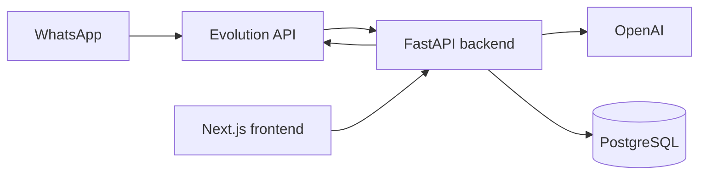

# Arquitectura

KAPO IA está organizado en tres piezas principales:



## Backend

El backend usa FastAPI y está ubicado en `backend/`.

Responsabilidades principales:

- Recibir webhooks de WhatsApp en `POST /webhook`.
- Ignorar mensajes antiguos de más de 2 minutos.
- Extraer el texto del mensaje y el número del remitente.
- Filtrar temporalmente por un número permitido.
- Enviar el texto a OpenAI para clasificar la intención.
- Registrar ingresos o ventas en la base de datos.
- Enviar confirmación al usuario por WhatsApp.

Capas:

| Carpeta | Responsabilidad |
| --- | --- |
| `routes` | Define endpoints FastAPI. |
| `services` | Contiene lógica de negocio y orquestación. |
| `repositories` | Encapsula escritura y lectura de base de datos. |
| `models` | Define tablas con SQLAlchemy. |
| `llm` | Cliente OpenAI y plantillas de prompt. |
| `core` | Configuración compartida, actualmente base de datos. |

## Frontend

El frontend usa Next.js App Router y está ubicado en `frontend/`.

Pantallas principales:

- `/`: autenticación por teléfono y OTP.
- `/dashboard`: panel principal del negocio.
- `/dashboard/productos`: módulo de carga o registro manual de productos.

Componentes relevantes:

- `components/auth`: formularios de login, registro y OTP.
- `components/dashboard`: cabecera y tarjetas de módulos.
- `components/productos`: carga Excel, selector de marca, checklist y tabla temporal.
- `lib/api.js`: cliente HTTP hacia FastAPI con fallback a datos demo para catálogo.
- `lib/auth.js`: sesión simple en `localStorage`.

## Evolution API

La carpeta `evolution_api/` incluye un `docker-compose.yml` con:

- `evolution-api`
- `postgres`
- `redis`

El backend usa Evolution API para enviar mensajes de texto con:

```text
POST {EVOLUTION_API_URL}/message/sendText/Kapo_IA
```

También existe código preparado para descargar audio desde Evolution API, convertirlo con ffmpeg y transcribirlo con OpenAI, pero ese bloque está comentado.

## Inteligencia artificial

La clasificación ocurre en `backend/services/ai_interprete.py`.

El prompt pide devolver solo JSON con esta estructura:

```json
{
  "accion": "INGRESO | VENTA | PREGUNTA | DESCONOCIDO",
  "items": [
    {
      "producto": "string",
      "cantidad": 1
    }
  ],
  "costo_total": 100,
  "pregunta_cliente": null
}
```

El modelo configurado actualmente es `gpt-4.1-mini`.

