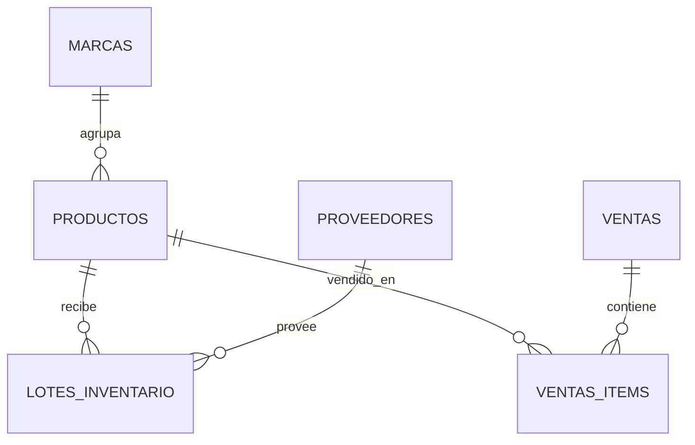

# Modelo de datos

Los modelos están definidos en `backend/models/models.py` con SQLAlchemy.

## Tablas

### `productos`

Representa productos del catálogo/inventario.

| Campo | Tipo | Descripción |
| --- | --- | --- |
| `id` | integer | Primary key. |
| `marca_id` | integer | Marca asociada. |
| `nombre` | string | Nombre del producto. |
| `unidad` | string | Unidad de medida. |
| `active` | boolean | Estado activo/inactivo. |
| `creado_a` | datetime | Fecha de creación. |
| `precio_venta` | numeric | Precio de venta. |

### `marcas`

Representa marcas de productos.

| Campo | Tipo | Descripción |
| --- | --- | --- |
| `id` | integer | Primary key. |
| `nombre` | integer | Nombre de marca. Actualmente está tipado como integer; debería ser string. |
| `creado_a` | datetime | Fecha de creación. |

### `proveedores`

Representa proveedores.

| Campo | Tipo | Descripción |
| --- | --- | --- |
| `id` | integer | Primary key. |
| `nombre` | string | Nombre del proveedor. |
| `numero` | string | Teléfono. |
| `email` | string | Email. |
| `creado_a` | datetime | Fecha de creación. |

### `lotes_inventario`

Representa ingresos de inventario.

| Campo | Tipo | Descripción |
| --- | --- | --- |
| `id` | integer | Primary key. |
| `producto_id` | integer | Producto ingresado. |
| `proveedor_id` | integer | Proveedor opcional. |
| `cantidad_recibida` | numeric | Cantidad recibida. |
| `costo_total` | numeric | Costo total del ingreso. |
| `costo_unitario` | numeric | Costo unitario calculado. |
| `fecha_recepcion` | datetime | Fecha del ingreso. |

### `ventas`

Cabecera de venta.

| Campo | Tipo | Descripción |
| --- | --- | --- |
| `id` | integer | Primary key. |
| `fecha_venta` | datetime | Fecha de venta. |
| `notes` | text | Notas opcionales. |

### `ventas_items`

Detalle de productos vendidos.

| Campo | Tipo | Descripción |
| --- | --- | --- |
| `id` | integer | Primary key. |
| `ventas_id` | integer | Venta asociada. |
| `producto_id` | integer | Producto vendido. |
| `cantidad` | numeric | Cantidad vendida. |

## Relaciones principales

## Consideraciones

- No hay migraciones configuradas todavía.
- El modelo no incluye `business_id`, aunque varias funciones lo reciben como parámetro.
- La tabla `marcas.nombre` debería cambiar de `Integer` a `String`.
- No hay relaciones SQLAlchemy declarativas con `relationship`; solo foreign keys.

